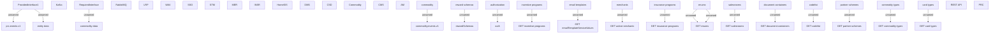

# Component model

```mermaid
graph TD
    ProvidedInterface1["ProvidedInterface1"]
    Kafka["Kafka"]
    el_1851268["RequiredInterface"]
    ProvidedInterface1["ProvidedInterface1"]
    commodity_events_v1["commodity.events.v1"]
    RabbitMQ["RabbitMQ"]
    rewardSchemas["rewardSchemas"]
    LRP["LRP"]
    GET_incentive_programs["GET incentive-programs"]
    WAV["WAV"]
    auth["auth"]
    SSO["SSO"]
    GET_emailTemplateServiceValues["GET emailTemplateServiceValues"]
    STM["STM"]
    GET_active_nerchants["GET active-nerchants"]
    MER["MER"]
    GET_insurance_programs["GET insurance-programs"]
    INSR["INSR"]
    GET_enums["GET enums"]
    GET_salesrooms["GET salesrooms"]
    HomeSIS["HomeSIS"]
    GET_document_containers["GET document-containers"]
    DMS["DMS"]
    GET_codelist["GET codelist"]
    CSD["CSD"]
    commodity_data["commodity data"]
    GET_partner_schemes["GET partner-schemes"]
    GET_commodity_types["GET commodity-types"]
    Commodity["Commodity"]
    GET_card_types["GET card types"]
    CMS["CMS"]
    GET_enums["GET enums"]
    AM["AM"]
    entity_data["entity data"]
    prc_events_v1["prc.events.v1"]
    commodity["commodity"]
    reward_schemas["reward schemas"]
    authorization["authorization"]
    incentive_programs["incentive programs"]
    email_templates["email templates"]
    merchants["merchants"]
    insurance_programs["insurance programs"]
    enums["enums"]
    salesrooms["salesrooms"]
    document_containers["document containers"]
    codelist["codelist"]
    partner_schemes["partner schemes"]
    commotity_types["commotity types"]
    card_types["card types"]
    enums["enums"]
    REST_API["REST API"]
    PRC["PRC"]
    merchants -->|unnamed| GET_active_nerchants
    card_types -->|unnamed| GET_card_types
    commotity_types -->|unnamed| GET_commodity_types
    partner_schemes -->|unnamed| GET_partner_schemes
    codelist -->|unnamed| GET_codelist
    document_containers -->|unnamed| GET_document_containers
    salesrooms -->|unnamed| GET_salesrooms
    enums -->|unnamed| GET_enums
    insurance_programs -->|unnamed| GET_insurance_programs
    el_1851268 -->|unnamed| commodity_data
    email_templates -->|unnamed| GET_emailTemplateServiceValues
    incentive_programs -->|unnamed| GET_incentive_programs
    authorization -->|unnamed| auth
    reward_schemas -->|unnamed| rewardSchemas
    commodity -->|unnamed| commodity_events_v1
    ProvidedInterface1 -->|unnamed| prc_events_v1
    ProvidedInterface1 -->|unnamed| entity_data
    enums -->|unnamed| GET_enums
```
