# SIR component model

- **Diagram Type**: Component
- **Package**: HomerSelect/BSL/Modules/Service Interpreter (SIR_NG)/SIR component model
- **Diagram ID**: 160678
- **Elements**: 70
- **Connectors**: 27

```mermaid
graph TD
    SignContract(("SignContract"))
    CreateContract(("CreateContract"))
    COMA[["COMA"]]
    ApprovalProcess(("ApprovalProcess"))
    Approval_system[["Approval system"]]
    GetServiceDefinition(("GetServiceDefinition"))
    Service_Catalogue[["Service Catalogue"]]
    getSupplementSetting(("getSupplementSetting"))
    AcceptContractSupplement(("AcceptContractSupplement"))
    CancelTransaction(("CancelTransaction"))
    AuthorizeTransaction(("AuthorizeTransaction"))
    ConfirmTransaction(("ConfirmTransaction"))
    getContractSupplement(("getContractSupplement"))
    refundTransaction(("refundTransaction"))
    cancelSupplement(("cancelSupplement"))
    authorizeTransactions(("authorizeTransactions"))
    addSalesQuote(("addSalesQuote"))
    createContractSupplement(("createContractSupplement"))
    SUP[["SUP"]]
    ProvidedInterface3(("ProvidedInterface3"))
    ProvidedInterface2(("ProvidedInterface2"))
    lap_sir_approvalProcessResult(("lap.sir.approvalProcessResult"))
    ext_incoming(("ext.incoming"))
    ext_approvalProcess(("ext.approvalProcess"))
    csi_sir_processing_result(("csi.sir.processing-result"))
    ProvidedInterface1(("ProvidedInterface1"))
    am_transaction_cancel(("am.transaction.cancel"))
    RabbitMQ_broker[["RabbitMQ broker"]]
    ProvidedInterface5(("ProvidedInterface5"))
    csi_contract_supplement(("csi.contract.supplement"))
    csi_contract_supplement(("csi.contract.supplement"))
    RMQ_broker[["RMQ broker"]]
    ContractSupplementDocumentPrepared(("ContractSupplementDocumentPrepared"))
    documentAcceptance(("documentAcceptance"))
    CreateRequest(("CreateRequest"))
    Main_orchestrator_ORP[["Main orchestrator (ORP)"]]
    ProvidedInterface3(("ProvidedInterface3"))
    CancelTransaction(("CancelTransaction"))
    AuthorizeTransaction(("AuthorizeTransaction"))
    ConfirmTransaction(("ConfirmTransaction"))
    AccountManagement[["AccountManagement"]]
    ContractSupplementNotification(("ContractSupplementNotification"))
    ContractServiceNotification(("ContractServiceNotification"))
    GetContractServices(("GetContractServices"))
    ActivateContractService(("ActivateContractService"))
    AddServiceToContract(("AddServiceToContract"))
    COS[["COS"]]
    GetSalesQuote(("GetSalesQuote"))
    SQS[["SQS"]]
    GetApplication(("GetApplication"))
    ADS[["ADS"]]
    CreateContract(("CreateContract"))
    ApprovalProcessResponse(("ApprovalProcessResponse"))
    ApprovaProcessRequest(("ApprovaProcessRequest"))
    getSupplementSetting(("getSupplementSetting"))
    csi_sir_processing_result(("csi.sir.processing-result"))
    ActivateContractService(("ActivateContractService"))
    GetTransactionSupplement(("GetTransactionSupplement"))
    csi_contract_supplement(("csi.contract.supplement"))
    AuthorizeTransactions(("AuthorizeTransactions"))
    GetServiceDefinition(("GetServiceDefinition"))
    cancelTransactions(("cancelTransactions"))
    addSalesQuote(("addSalesQuote"))
    createContractSupplement(("createContractSupplement"))
    SignContract(("SignContract"))
    AddService(("AddService"))
    GetSalesQuote(("GetSalesQuote"))
    GetApplication(("GetApplication"))
    process_loan(("process-loan"))
    ServiceInterpreter[["ServiceInterpreter"]]
    csi_sir_processing_result -->|unnamed| csi_sir_processing_result
    CreateContract -->|unnamed| CreateContract
    ext_approvalProcess -->|unnamed| ApprovalProcess
    GetServiceDefinition -->|unnamed| GetServiceDefinition
    getSupplementSetting -->|unnamed| getSupplementSetting
    documentAcceptance -->|unnamed| AcceptContractSupplement
    am_transaction_cancel -->|unnamed| CancelTransaction
    GetTransactionSupplement -->|unnamed| getContractSupplement
    AuthorizeTransactions -->|unnamed| authorizeTransactions
    addSalesQuote -->|unnamed| addSalesQuote
    createContractSupplement -->|unnamed| createContractSupplement
    ContractServiceNotification -->|unnamed| ProvidedInterface2
    SignContract -->|unnamed| SignContract
    ApprovaProcessRequest -->|unnamed| ext_incoming
    CreateRequest -->|unnamed| process_loan
    csi_contract_supplement -->|unnamed| csi_contract_supplement
    ContractSupplementNotification -->|unnamed| csi_contract_supplement
    ProvidedInterface5 -->|unnamed| ContractSupplementDocumentPrepared
    ProvidedInterface3 -->|unnamed| ProvidedInterface3
    ProvidedInterface1 -->|unnamed| CancelTransaction
    AuthorizeTransaction -->|unnamed| AuthorizeTransaction
    ConfirmTransaction -->|unnamed| ConfirmTransaction
    ActivateContractService -->|unnamed| ActivateContractService
    AddService -->|unnamed| AddServiceToContract
    GetSalesQuote -->|unnamed| GetSalesQuote
    GetApplication -->|unnamed| GetApplication
    ApprovalProcessResponse -->|unnamed| lap_sir_approvalProcessResult
```

