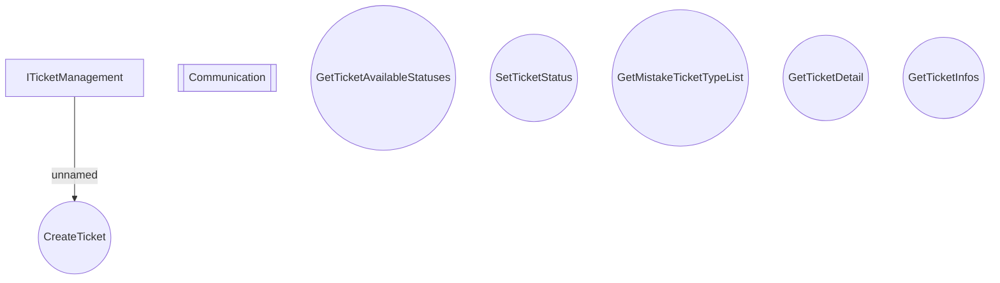

# Component model

- **Diagram Type**: Component
- **Package**: HomerSelect/BSL/Modules/Ticketing (TCK)/Component model
- **Diagram ID**: 159951
- **Elements**: 9
- **Connectors**: 1

```mermaid
graph TD
    ITicketManagement(("ITicketManagement"))
    Communication[["Communication"]]
    GetTicketAvailableStatuses(("GetTicketAvailableStatuses"))
    SetTicketStatus(("SetTicketStatus"))
    GetMistakeTicketTypeList(("GetMistakeTicketTypeList"))
    GetTicketDetail(("GetTicketDetail"))
    CreateTicket(("CreateTicket"))
    GetTicketInfos(("GetTicketInfos"))
    ITicketManagement["ITicketManagement"]
    ITicketManagement -->|unnamed| CreateTicket
```
