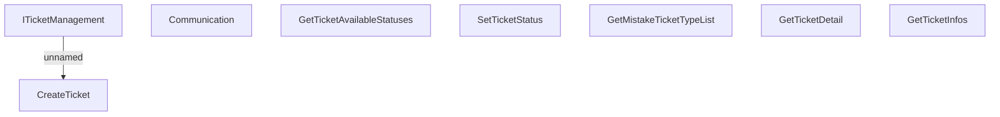

# Component model

```mermaid
graph TD
    ITicketManagement["ITicketManagement"]
    Communication["Communication"]
    GetTicketAvailableStatuses["GetTicketAvailableStatuses"]
    SetTicketStatus["SetTicketStatus"]
    GetMistakeTicketTypeList["GetMistakeTicketTypeList"]
    GetTicketDetail["GetTicketDetail"]
    CreateTicket["CreateTicket"]
    GetTicketInfos["GetTicketInfos"]
    ITicketManagement["ITicketManagement"]
    ITicketManagement -->|unnamed| CreateTicket
```
