# {MOD}Ticketing API

- **Diagram Type**: Component
- **Package**: HomerSelect/BSL/Modules/Ticketing (TCK)/Interface Provided/Web Services/Ticketing API
- **Diagram ID**: 159961
- **Elements**: 33
- **Connectors**: 9

```mermaid
graph TD
    queues_queueCode_user_userLogin["/queues/{queueCode}/user/{userLogin}"]
    queues_users["/queues/users"]
    queues_queueCode["/queues/{queueCode}"]
    queues["/queues"]
    getQueue_getQueue["getQueue : getQueue"]
    addTransition_addTransition["addTransition : addTransition"]
    tickets_ticketCode_transitions["/tickets/{ticketCode}/transitions"]
    listTypeSpecifications_listTypeSpecifications["listTypeSpecifications : listTypeSpecifications"]
    listSearchTypes_listSearchTypes["listSearchTypes : listSearchTypes"]
    listTypes_listTypes["listTypes : listTypes"]
    search_types["/search-types"]
    type_specifications["/type-specifications"]
    types["/types"]
    statuses["/statuses"]
    search_ticketInfos["search : ticketInfos"]
    ticket_infos["/ticket-infos"]
    listDepartments_listDepartments["listDepartments : listDepartments"]
    departments_departmentCode_users["/departments/{departmentCode}/users"]
    departments["/departments"]
    getDepartmentUsers_getDepartmentUsers["getDepartmentUsers : getDepartmentUsers"]
    assignTicketFromQueue_assignTicketFromQueue["assignTicketFromQueue : assignTicketFromQueue"]
    listQueues_listQueues["listQueues : listQueues"]
    addTicketToQueue_removeTicketFromQueue["addTicketToQueue :removeTicketFromQueue"]
    tickets_ticketCode_queues_queueCode["/tickets/{ticketCode}/queues/{queueCode}"]
    assignments_tickets_ticketCode["/assignments/tickets/{ticketCode}"]
    getTicketQueues_getTicketQueues["getTicketQueues : getTicketQueues"]
    assignTicketToUser_assignTicketToUser["assignTicketToUser : assignTicketToUser"]
    getTicket_getTicket["getTicket : getTicket"]
    createTicket_createTicket["createTicket : createTicket"]
    assignments_tickets["/assignments/tickets"]
    tickets_ticketCode_queues["/tickets/{ticketCode}/queues"]
    tickets_ticketCode["/tickets/{ticketCode} "]
    tickets["/tickets"]
    assignments_tickets_ticketCode -->|unnamed| assignments_tickets
    departments_departmentCode_users -->|unnamed| departments
    queues_queueCode_user_userLogin -->|unnamed| queues_queueCode
    queues_queueCode -->|unnamed| queues
    queues_users -->|unnamed| queues
    tickets_ticketCode_queues_queueCode -->|unnamed| tickets_ticketCode_queues
    tickets_ticketCode_transitions -->|unnamed| tickets_ticketCode
    tickets_ticketCode_queues -->|unnamed| tickets_ticketCode
    tickets_ticketCode -->|unnamed| tickets
```

