# Insurance component model

- **Diagram Type**: Component
- **Package**: HomerSelect/BSL/Modules/Value Added Services (VAS)/Component model
- **Diagram ID**: 142786
- **Elements**: 28
- **Connectors**: 28

```mermaid
graph TD
    Web_Services_Web_Services_Resource_overview["Web Services : Web Services - Resource overview"]
    Use_Case_Model_Insurance_Program_functions["Use Case Model : Insurance Program functions"]
    Logical_Data_Model_Logical_Data_Model["Logical Data Model : Logical Data Model"]
    Ineligible_Professions_IP_Ineligible_Professions_Use_Case_Mo["Ineligible Professions :  IP - Ineligible Professions - Use Case Model"]
    Eligible_Commodities_IP_Eligible_Commodities_Use_Case_Model["Eligible Commodities : IP - Eligible Commodities - Use Case Model"]
    Custom_Data_IP_Custom_Data_Use_Case_Model["Custom Data : IP - Custom Data - Use Case Model"]
    Use_Case_Model_Insurance_Program_management_Use_Case_Model["Use Case Model : Insurance Program management - Use Case Model"]
    Ineligible_professions_tab_Ineligible_professions_tab["Ineligible professions tab : Ineligible professions tab"]
    Eligible_commodities_tab_Eligible_commodities_tab["Eligible commodities tab : Eligible commodities tab"]
    Custom_data_tab_Custom_data_tab["Custom data tab : Custom data tab"]
    User_Interface_Model_Search_for_Insurance_Program["User Interface Model : Search for Insurance Program"]
    User_Interface_Model_Create_Insurance_Program["User Interface Model : Create Insurance Program"]
    Product_Calculator[["Product Calculator"]]
    User_Interface_Model_Set_main_Insurance_Program_properties["User Interface Model : Set main Insurance Program properties"]
    User_Interface_Model_Show_Insurance_Program["User Interface Model : Show Insurance Program"]
    unnamed["unnamed"]
    unnamed["unnamed"]
    BSL_Contract_Origination[["BSL Contract Origination"]]
    Account_Management[["Account Management"]]
    unnamed["unnamed"]
    unnamed["unnamed"]
    Module_Support[["Module Support"]]
    UserInterface[["UserInterface"]]
    BSL_InsuranceContractDomain[["BSL InsuranceContractDomain"]]
    ContractInsuranceService[["ContractInsuranceService"]]
    InsuranceProgram[["InsuranceProgram"]]
    INSR["INSR"]
    BSL["BSL"]
    User_Interface_Model_Set_main_Insurance_Program_properties -->|unnamed| UserInterface
    INSR -->|unnamed| BSL_Contract_Origination
    unnamed -->|unnamed| BSL_Contract_Origination
    ContractInsuranceService -->|unnamed| BSL_Contract_Origination
    unnamed -->|unnamed| Account_Management
    BSL_InsuranceContractDomain -->|unnamed| Account_Management
    unnamed -->|unnamed| Module_Support
    InsuranceProgram -->|unnamed| Module_Support
    Ineligible_professions_tab_Ineligible_professions_tab -->|unnamed| UserInterface
    Eligible_commodities_tab_Eligible_commodities_tab -->|unnamed| UserInterface
    Custom_data_tab_Custom_data_tab -->|unnamed| UserInterface
    User_Interface_Model_Search_for_Insurance_Program -->|unnamed| UserInterface
    BSL_Contract_Origination -->|unnamed| Product_Calculator
    User_Interface_Model_Show_Insurance_Program -->|unnamed| UserInterface
    Web_Services_Web_Services_Resource_overview -->|unnamed| INSR
    ContractInsuranceService -->|unnamed| BSL_InsuranceContractDomain
    unnamed -->|unnamed| ContractInsuranceService
    INSR -->|unnamed| ContractInsuranceService
    Use_Case_Model_Insurance_Program_functions -->|unnamed| InsuranceProgram
    Logical_Data_Model_Logical_Data_Model -->|unnamed| InsuranceProgram
    Ineligible_Professions_IP_Ineligible_Professions_Use_Case_Mo -->|unnamed| InsuranceProgram
    Eligible_Commodities_IP_Eligible_Commodities_Use_Case_Model -->|unnamed| InsuranceProgram
    Custom_Data_IP_Custom_Data_Use_Case_Model -->|unnamed| InsuranceProgram
    UserInterface -->|unnamed| InsuranceProgram
    Use_Case_Model_Insurance_Program_management_Use_Case_Model -->|unnamed| InsuranceProgram
    Product_Calculator -->|unnamed| INSR
    BSL_InsuranceContractDomain -->|unnamed| INSR
    User_Interface_Model_Create_Insurance_Program -->|unnamed| UserInterface
```

