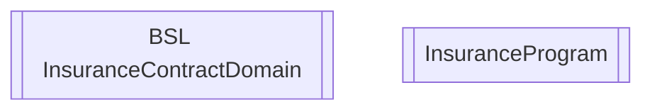

# InsuranceModule

- **Diagram Type**: Component
- **Package**: HomerSelect/BSL/Modules/Value Added Services (VAS)/Component model/INSR
- **Diagram ID**: 141406
- **Elements**: 2
- **Connectors**: 0

