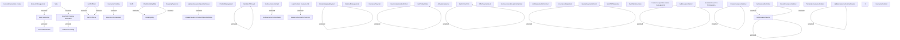

# InsuranceContract - Integration model

```mermaid
graph TD
    AccountTransaction_Create["AccountTransaction.Create"]
    Account_Management["Account Management"]
    el_1590647["Note"]
    EoM_Debt_Catalog_notification["EoM Debt Catalog notification"]
    EoM_notification["EoM notification"]
    LoanContract_Insurance_FE["LoanContract Insurance FE"]
    CalculateTIAmount["CalculateTIAmount"]
    GetTariffItems["GetTariffItems"]
    Tariffs["Tariffs"]
    CreateOutgoingPayment["CreateOutgoingPayment"]
    OutgoingPayments["OutgoingPayments"]
    GetProductData["GetProductData"]
    ProductManagement["ProductManagement"]
    GetTariffItem["GetTariffItem"]
    CreateOutgoingPayment["CreateOutgoingPayment"]
    AddInsurancePeriod["AddInsurancePeriod"]
    GetProductData["GetProductData"]
    CreateInsuranceContract["CreateInsuranceContract"]
    Insurance_Replacement["Insurance Replacement"]
    GetContractInfo["GetContractInfo"]
    ContractManagement["ContractManagement"]
    DataEligibility["DataEligibility"]
    InsuranceProgram["InsuranceProgram"]
    GetInsuranceService["GetInsuranceService"]
    InsuranceServiceDefinition["InsuranceServiceDefinition"]
    CalculateTIAmount["CalculateTIAmount"]
    GetTariffItem["GetTariffItem"]
    GetContractInfo["GetContractInfo"]
    CheckDataEligibility["CheckDataEligibility"]
    ActivateInsurance["ActivateInsurance"]
    GetIsuranceDefinition["GetIsuranceDefinition"]
    OfferInsuranceList["OfferInsuranceList"]
    GetInsuranceOnLoanContractList["GetInsuranceOnLoanContractList"]
    CreateInsuranceContract["CreateInsuranceContract"]
    AddInsuranceOnContract["AddInsuranceOnContract"]
    InsuranceOrigination["InsuranceOrigination"]
    UpdateInsuranceOperationStatus["UpdateInsuranceOperationStatus"]
    SwitchOffInsurance["SwitchOffInsurance"]
    SwitchOnInsurance["SwitchOnInsurance"]
    Insurance_operation_status_management["Insurance operation status management"]
    EoM_Debt_Catalog["EoM Debt Catalog"]
    AccountNotification["AccountNotification"]
    GetInsuranceService["GetInsuranceService"]
    CheckDataEligibility["CheckDataEligibility"]
    UpdateInsurancePeriod["UpdateInsurancePeriod"]
    AddInsurancePeriod["AddInsurancePeriod"]
    AutomaticInsurance_Prolongation["AutomaticInsurance Prolongation"]
    GetInsuranceContract["GetInsuranceContract"]
    GetIsuranceDefinition["GetIsuranceDefinition"]
    UpdateInsuranceContractStatus["UpdateInsuranceContractStatus"]
    CancelInsuranceContract["CancelInsuranceContract"]
    TerminateInsuranceContract["TerminateInsuranceContract"]
    InsuranceFinishing["InsuranceFinishing"]
    X["X"]
    UpdateInsurancePeriod["UpdateInsurancePeriod"]
    UpdateInsuranceContractOperationStatus["UpdateInsuranceContractOperationStatus"]
    UpdateInsuranceContractStatus["UpdateInsuranceContractStatus"]
    AddInsurancePeriod["AddInsurancePeriod"]
    CreateInsuranceContract["CreateInsuranceContract"]
    GetInsuranceContractDetail["GetInsuranceContractDetail"]
    InsuranceContract["InsuranceContract"]
    InsuranceServiceOrchestrator["InsuranceServiceOrchestrator"]
    el_1590647 -->|unnamed| EoM_notification
    CalculateTIAmount -->|unnamed| CalculateTIAmount
    GetTariffItem -->|unnamed| GetTariffItems
    GetTariffItem -->|unnamed| GetTariffItems
    CreateOutgoingPayment -->|unnamed| CreateOutgoingPayment
    GetProductData -->|unnamed| GetProductData
    GetContractInfo -->|unnamed| GetContractInfo
    CheckDataEligibility -->|unnamed| DataEligibility
    CheckDataEligibility -->|unnamed| DataEligibility
    el_1590647 -->|unnamed| EoM_Debt_Catalog_notification
    GetIsuranceDefinition -->|unnamed| GetInsuranceService
    LoanContract_Insurance_FE -->|unnamed| InsuranceServiceOrchestrator
    EoM_Debt_Catalog_notification -->|unnamed| EoM_Debt_Catalog
    EoM_notification -->|unnamed| AccountNotification
    UpdateInsurancePeriod -->|unnamed| UpdateInsurancePeriod
    UpdateInsuranceOperationStatus -->|unnamed| UpdateInsuranceContractOperationStatus
    AddInsurancePeriod -->|unnamed| AddInsurancePeriod
    AddInsurancePeriod -->|unnamed| AddInsurancePeriod
    CreateInsuranceContract -->|unnamed| CreateInsuranceContract
    CreateInsuranceContract -->|unnamed| CreateInsuranceContract
    GetInsuranceService -->|unnamed| GetInsuranceService
    GetIsuranceDefinition -->|unnamed| GetInsuranceService
    InsuranceFinishing -->|unnamed| Insurance_Replacement
    UpdateInsuranceContractStatus -->|unnamed| UpdateInsuranceContractStatus
    GetInsuranceContract -->|unnamed| GetInsuranceContractDetail
```
