# NOT UPDATED BSL splitting proposal - Component model

- **Diagram Type**: Component
- **Package**: HomerSelect/BSL/Modules/_Component model/Original Splitting proposal
- **Diagram ID**: 141405
- **Elements**: 38
- **Connectors**: 52

```mermaid
graph TD
    BSA_Bulk_service_assignment[["BSA:Bulk service assignment"]]
    Card_Management[["Card Management"]]
    REL_Account_transaction_support[["REL Account transaction support"]]
    INSR_Insurance_Program[["INSR:Insurance Program"]]
    Loan_Services[["Loan Services"]]
    Commodity_management[["Commodity management"]]
    Insurance_Contract[["Insurance Contract"]]
    CIF[["CIF"]]
    Cabinet[["Cabinet"]]
    DMS_Document_management[["DMS:Document management"]]
    Payment_Channels[["Payment Channels"]]
    Product_offer_management[["Product offer management"]]
    REL_Account_Management[["REL Account Management"]]
    Currency_Convertor[["Currency Convertor"]]
    Refunds[["Refunds"]]
    DDM[["DDM"]]
    Payment_Card_support[["Payment Card support"]]
    Direct_debiting[["Direct debiting"]]
    Outgoing_payments[["Outgoing payments"]]
    Incoming_payments[["Incoming payments"]]
    Bank_management[["Bank management"]]
    Supplements[["Supplements"]]
    Client_center[["Client center"]]
    Communication[["Communication"]]
    Ticketing[["Ticketing"]]
    Installment_Schedule[["Installment Schedule"]]
    SNM[["SNM"]]
    Product_catalog_PRC[["Product catalog (PRC)"]]
    Fees_Penalties[["Fees and Penalties"]]
    Debt_Catalog[["Debt Catalog"]]
    Contract_Management[["Contract Management"]]
    Application_origination[["Application origination"]]
    Contract_management["Contract management"]
    Contract_origination_Sales["Contract origination (Sales)"]
    CEL_Account_Management["CEL Account Management"]
    Payments["Payments"]
    Product_management["Product management"]
    CSI["CSI"]
    Insurance_Contract -->|unnamed| Outgoing_payments
    REL_Account_transaction_support -->|unnamed| REL_Account_Management
    Incoming_payments -->|unnamed| REL_Account_Management
    Insurance_Contract -->|unnamed| REL_Account_Management
    Direct_debiting -->|unnamed| Payment_Channels
    DDM -->|unnamed| Payment_Channels
    Loan_Services -->|unnamed| DMS_Document_management
    DMS_Document_management -->|unnamed| Cabinet
    Loan_Services -->|unnamed| Insurance_Contract
    REL_Account_transaction_support -->|unnamed| Commodity_management
    Product_offer_management -->|unnamed| Commodity_management
    Outgoing_payments -->|unnamed| Payment_Channels
    BSA_Bulk_service_assignment -->|unnamed| Loan_Services
    BSA_Bulk_service_assignment -->|unnamed| Contract_Management
    Loan_Services -->|unnamed| Debt_Catalog
    REL_Account_transaction_support -->|unnamed| Bank_management
    INSR_Insurance_Program -->|unnamed| SNM
    Product_offer_management -->|unnamed| SNM
    Outgoing_payments -->|unnamed| SNM
    Incoming_payments -->|unnamed| Installment_Schedule
    Loan_Services -->|unnamed| Installment_Schedule
    Direct_debiting -->|unnamed| Installment_Schedule
    Payment_Card_support -->|unnamed| Card_Management
    Loan_Services -->|unnamed| Supplements
    Product_offer_management -->|unnamed| Product_catalog_PRC
    Client_center -->|unnamed| CIF
    Supplements -->|unnamed| REL_Account_Management
    Client_center -->|unnamed| Communication
    Contract_Management -->|unnamed| Fees_Penalties
    Application_origination -->|unnamed| Commodity_management
    Application_origination -->|unnamed| Payment_Channels
    Application_origination -->|unnamed| INSR_Insurance_Program
    Application_origination -->|unnamed| Bank_management
    Application_origination -->|unnamed| Contract_Management
    Application_origination -->|unnamed| DMS_Document_management
    Application_origination -->|unnamed| Insurance_Contract
    Application_origination -->|unnamed| Product_offer_management
    Contract_Management -->|unnamed| Product_catalog_PRC
    Product_catalog_PRC -->|unnamed| INSR_Insurance_Program
    Product_catalog_PRC -->|unnamed| Commodity_management
    Contract_Management -->|unnamed| Insurance_Contract
    Contract_Management -->|unnamed| Debt_Catalog
    Contract_Management -->|unnamed| Payment_Card_support
    Contract_Management -->|unnamed| SNM
    Contract_Management -->|unnamed| REL_Account_transaction_support
    Contract_Management -->|unnamed| DMS_Document_management
    Contract_Management -->|unnamed| Payment_Channels
    Contract_Management -->|unnamed| Installment_Schedule
    Communication -->|unnamed| Ticketing
    Ticketing -->|unnamed| DMS_Document_management
    Installment_Schedule -->|unnamed| Refunds
    SNM -->|unnamed| Bank_management
```

