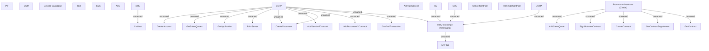

# Loan application processing - components

```mermaid
graph TD
    PIF["PIF"]
    NTF_KZ["NTF KZ"]
    CreateDocument["CreateDocument"]
    DSM["DSM"]
    Service_Catalogue["Service Catalogue"]
    el_1834016["Text"]
    GetSalesQuotes["GetSalesQuotes"]
    SQS["SQS"]
    GetApplication["GetApplication"]
    ADS["ADS"]
    Cabinet["Cabinet"]
    PrintServer["PrintServer"]
    ConfirmTransaction["ConfirmTransaction"]
    CreateAccount["CreateAccount"]
    AM["AM"]
    CreateDocument["CreateDocument"]
    DMS["DMS"]
    ActivateService["ActivateService"]
    AddService2Contract["AddService2Contract"]
    COS["COS"]
    RMQ_exchange_messaging["RMQ exchange (messaging)"]
    GetContractSupplement["GetContractSupplement"]
    AddSalesQuote["AddSalesQuote"]
    SUPP["SUPP"]
    GetContract["GetContract"]
    CancelContract["CancelContract"]
    TerminateContract["TerminateContract"]
    AddDocument2Contract["AddDocument2Contract"]
    Sign_ActivateContract["Sign/ActivateContract"]
    CreateContract["CreateContract"]
    COMA["COMA"]
    Process_orchestrator_Zeebe["Process orchestrator (Zeebe)"]
    AM -->|unnamed| RMQ_exchange_messaging
    SUPP -->|unnamed| CreateAccount
    SUPP -->|unnamed| GetSalesQuotes
    SUPP -->|unnamed| GetApplication
    DMS -->|unnamed| Cabinet
    SUPP -->|unnamed| PrintServer
    SUPP -->|unnamed| CreateDocument
    SUPP -->|unnamed| AddService2Contract
    RMQ_exchange_messaging -->|unnamed| NTF_KZ
    COS -->|unnamed| RMQ_exchange_messaging
    SUPP -->|unnamed| CreateDocument
    COMA -->|unnamed| RMQ_exchange_messaging
    Process_orchestrator_Zeebe -->|unnamed| AddSalesQuote
    SUPP -->|unnamed| AddDocument2Contract
    Process_orchestrator_Zeebe -->|unnamed| Sign_ActivateContract
    Process_orchestrator_Zeebe -->|unnamed| CreateContract
    Process_orchestrator_Zeebe -->|unnamed| GetContractSupplement
    Process_orchestrator_Zeebe -->|unnamed| GetContract
    SUPP -->|unnamed| ConfirmTransaction
    SUPP -->|unnamed| RMQ_exchange_messaging
```
