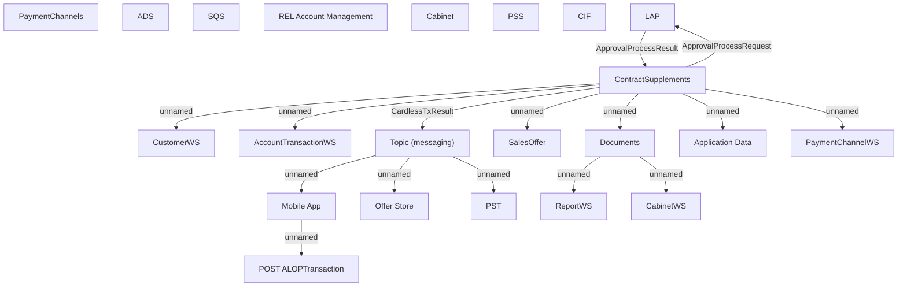

# Component model

```mermaid
graph TD
    PaymentChannelWS["PaymentChannelWS"]
    PaymentChannels["PaymentChannels"]
    Application_Data["Application Data"]
    ADS["ADS"]
    Documents["Documents"]
    PST["PST"]
    SalesOffer["SalesOffer"]
    SQS["SQS"]
    Topic_messaging["Topic (messaging)"]
    Offer_Store["Offer Store"]
    AccountTransactionWS["AccountTransactionWS"]
    REL_Account_Management["REL Account Management"]
    CabinetWS["CabinetWS"]
    Cabinet["Cabinet"]
    ReportWS["ReportWS"]
    PSS["PSS"]
    CustomerWS["CustomerWS"]
    CIF["CIF"]
    LAP["LAP"]
    Mobile_App["Mobile App"]
    POST_ALOPTransaction["POST ALOPTransaction"]
    ContractSupplements["ContractSupplements"]
    Mobile_App -->|unnamed| POST_ALOPTransaction
    Topic_messaging -->|unnamed| Mobile_App
    ContractSupplements -->|ApprovalProcessRequest| LAP
    ContractSupplements -->|unnamed| CustomerWS
    Documents -->|unnamed| ReportWS
    Documents -->|unnamed| CabinetWS
    ContractSupplements -->|unnamed| AccountTransactionWS
    Topic_messaging -->|unnamed| Offer_Store
    ContractSupplements -->|CardlessTxResult| Topic_messaging
    ContractSupplements -->|unnamed| SalesOffer
    Topic_messaging -->|unnamed| PST
    ContractSupplements -->|unnamed| Documents
    ContractSupplements -->|unnamed| Application_Data
    ContractSupplements -->|unnamed| PaymentChannelWS
    LAP -->|ApprovalProcessResult| ContractSupplements
```
