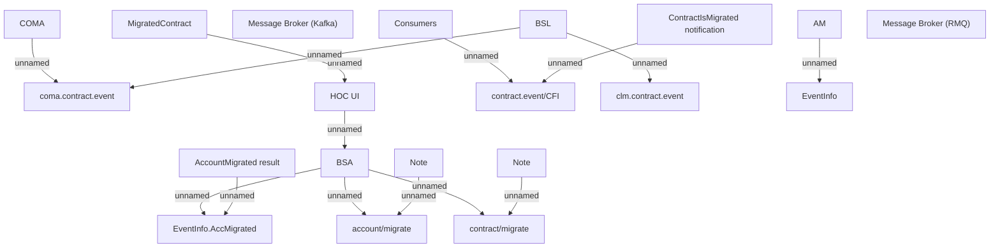

# Involved components

```mermaid
graph TD
    AccountMigrated_result["AccountMigrated result"]
    el_1881378["Note"]
    el_1881376["Note"]
    ContractIsMigrated_notification["ContractIsMigrated notification"]
    Consumers["Consumers"]
    coma_contract_event["coma.contract.event"]
    coma_contract_event["coma.contract.event"]
    Message_Broker_Kafka["Message Broker (Kafka)"]
    MigratedContract["MigratedContract"]
    contract_migrate["contract/migrate"]
    COMA["COMA"]
    HOC_UI["HOC UI"]
    account_migrate["account/migrate"]
    AM["AM"]
    BSL["BSL"]
    contract_event_CFI["contract.event/CFI"]
    clm_contract_event["clm.contract.event"]
    EventInfo["EventInfo"]
    EventInfo_AccMigrated["EventInfo.AccMigrated"]
    Message_Broker_RMQ["Message Broker (RMQ)"]
    BSA["BSA"]
    HOC_UI -->|unnamed| BSA
    BSA -->|unnamed| EventInfo_AccMigrated
    AccountMigrated_result -->|unnamed| EventInfo_AccMigrated
    AM -->|unnamed| EventInfo
    BSL -->|unnamed| clm_contract_event
    Consumers -->|unnamed| contract_event_CFI
    ContractIsMigrated_notification -->|unnamed| contract_event_CFI
    BSA -->|unnamed| account_migrate
    el_1881376 -->|unnamed| account_migrate
    MigratedContract -->|unnamed| HOC_UI
    BSA -->|unnamed| contract_migrate
    el_1881378 -->|unnamed| contract_migrate
    COMA -->|unnamed| coma_contract_event
    BSL -->|unnamed| coma_contract_event
```
