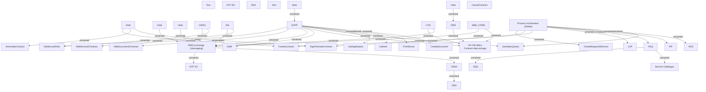

# SME components

```mermaid
graph TD
    PIF["PIF"]
    el_1823948["Text"]
    NTF_KZ["NTF KZ"]
    NTF_EIT["NTF EIT"]
    DSM["DSM"]
    RSA["RSA"]
    Service_Catalogue["Service Catalogue"]
    LAP["LAP"]
    ASQ["ASQ"]
    OBS["OBS"]
    CBSA["CBSA"]
    el_1823950["Text"]
    GetSalesQuotes["GetSalesQuotes"]
    SQS["SQS"]
    GetApplication["GetApplication"]
    ADS["ADS"]
    el_1823924["Note"]
    el_1823943["Note"]
    el_1823940["Note"]
    el_1823938["Note"]
    Cabinet["Cabinet"]
    PrintServer["PrintServer"]
    el_1823933["Note"]
    CMSG["CMSG"]
    AM["AM"]
    CreateDocument["CreateDocument"]
    DMS["DMS"]
    GetServiceRole["GetServiceRole"]
    AddService2Contract["AddService2Contract"]
    COS["COS"]
    HO_DB_BSL_Contract_data_storage["HO DB (BSL)
Contract data storage"]
    RMQ_exchange_messaging["RMQ exchange (messaging)"]
    CreateRequest4Service["CreateRequest4Service"]
    SUPP["SUPP"]
    CancelContract["CancelContract"]
    TerminateContract["TerminateContract"]
    AddDocument2Contract["AddDocument2Contract"]
    Sign_ActivateContract["Sign/ActivateContract"]
    CreateContract["CreateContract"]
    SME_COMA["SME_COMA"]
    Process_orchestrator_Zeebe["Process orchestrator (Zeebe)"]
    Process_orchestrator_Zeebe -->|unnamed| GetSalesQuotes
    CMSG -->|unnamed| GetServiceRole
    el_1823940 -->|unnamed| DMS
    SUPP -->|unnamed| CreateDocument
    SUPP -->|unnamed| PrintServer
    SUPP -->|unnamed| Cabinet
    Process_orchestrator_Zeebe -->|unnamed| ADS
    SUPP -->|unnamed| GetApplication
    Process_orchestrator_Zeebe -->|unnamed| PIF
    SUPP -->|unnamed| GetSalesQuotes
    SUPP -->|unnamed| HO_DB_BSL_Contract_data_storage
    RMQ_exchange_messaging -->|unnamed| CBSA
    CBSA -->|unnamed| OBS
    Process_orchestrator_Zeebe -->|unnamed| ASQ
    Process_orchestrator_Zeebe -->|unnamed| LAP
    ASQ -->|unnamed| Service_Catalogue
    SUPP -->|unnamed| DSM
    RMQ_exchange_messaging -->|unnamed| NTF_KZ
    ASQ -->|unnamed| SQS
    SUPP -->|unnamed| RMQ_exchange_messaging
    Process_orchestrator_Zeebe -->|unnamed| CreateContract
    Process_orchestrator_Zeebe -->|unnamed| Sign_ActivateContract
    el_1823943 -->|unnamed| Sign_ActivateContract
    SUPP -->|unnamed| AddDocument2Contract
    el_1823943 -->|unnamed| TerminateContract
    el_1823924 -->|unnamed| SUPP
    Process_orchestrator_Zeebe -->|unnamed| CreateRequest4Service
    AM -->|unnamed| GetServiceRole
    COS -->|unnamed| RMQ_exchange_messaging
    SUPP -->|unnamed| AddService2Contract
    AM -->|unnamed| RMQ_exchange_messaging
    CMSG -->|unnamed| RMQ_exchange_messaging
    el_1823933 -->|unnamed| RMQ_exchange_messaging
    el_1823938 -->|unnamed| RMQ_exchange_messaging
    SME_COMA -->|unnamed| HO_DB_BSL_Contract_data_storage
    COS -->|unnamed| HO_DB_BSL_Contract_data_storage
    DMS -->|unnamed| HO_DB_BSL_Contract_data_storage
    el_1823943 -->|unnamed| CreateContract
    SME_COMA -->|unnamed| RMQ_exchange_messaging
```
