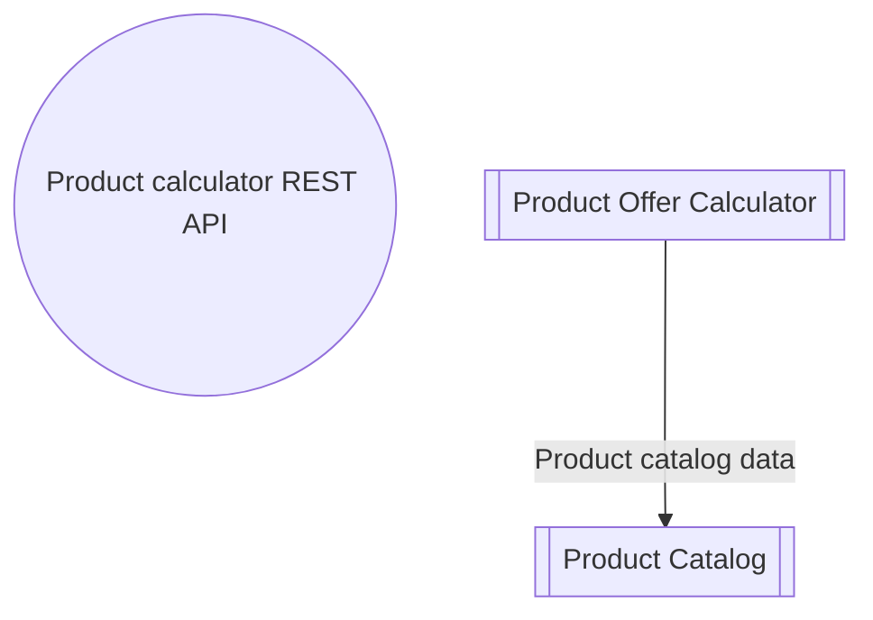

# Product Offer Calculator

- **Diagram Type**: Component
- **Package**: HomerSelect/BSL/Requirements Model/In process/PCG/Various things
- **Diagram ID**: 163166
- **Elements**: 3
- **Connectors**: 1

