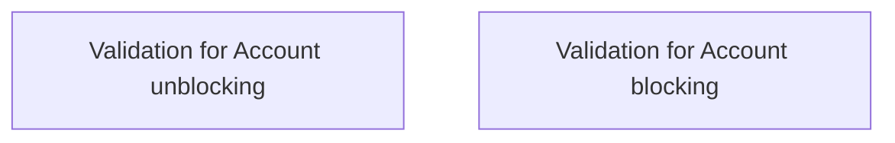

# Rules: Account Blockage

- **Diagram Type**: Custom
- **Package**: HomerSelect/BSL/Analysis Model/Account management/Account blockage/Business rules
- **Diagram ID**: 63667
- **Elements**: 2
- **Connectors**: 0

