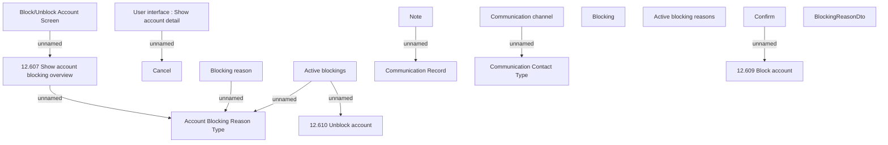

# UI: Account blockage

```mermaid
graph TD
    Account_Blocking_Reason_Type["Account Blocking Reason Type"]
    User_interface_Show_account_detail["User interface : Show account detail"]
    n_12_607_Show_account_blocking_overview["12.607 Show account blocking overview"]
    Communication_channel["Communication channel"]
    Cancel["Cancel"]
    Confirm["Confirm"]
    Note["Note"]
    Blocking_reason["Blocking reason"]
    Blocking["Blocking"]
    Active_blockings["Active blockings"]
    Active_blocking_reasons["Active blocking reasons"]
    Communication_Record["Communication Record"]
    Communication_Contact_Type["Communication Contact Type"]
    n_12_610_Unblock_account["12.610 Unblock account"]
    n_12_609_Block_account["12.609 Block account"]
    Block_Unblock_Account_Screen["Block/Unblock Account Screen"]
    BlockingReasonDto["BlockingReasonDto"]
    Confirm -->|unnamed| n_12_609_Block_account
    Active_blockings -->|unnamed| n_12_610_Unblock_account
    Communication_channel -->|unnamed| Communication_Contact_Type
    Note -->|unnamed| Communication_Record
    User_interface_Show_account_detail -->|unnamed| Cancel
    Block_Unblock_Account_Screen -->|unnamed| n_12_607_Show_account_blocking_overview
    Blocking_reason -->|unnamed| Account_Blocking_Reason_Type
    Active_blockings -->|unnamed| Account_Blocking_Reason_Type
    n_12_607_Show_account_blocking_overview -->|unnamed| Account_Blocking_Reason_Type
```
