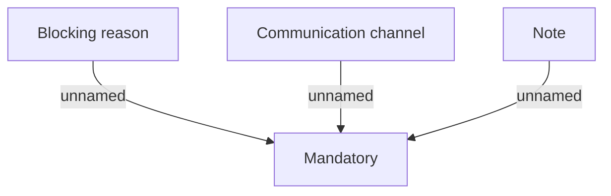

# Validation: Account blockage

- **Diagram Type**: Custom
- **Package**: HomerSelect/BSL/Analysis Model/Account management/Account blockage/Validation rules
- **Diagram ID**: 63668
- **Elements**: 4
- **Connectors**: 3

