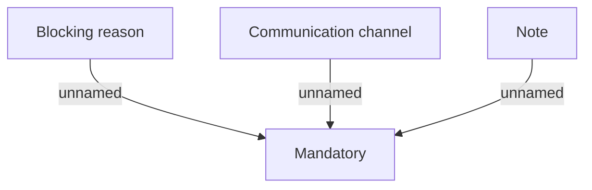

# Validation: Account blockage

```mermaid
graph TD
    Blocking_reason["Blocking reason"]
    Communication_channel["Communication channel"]
    Note["Note"]
    Mandatory["Mandatory"]
    Blocking_reason -->|unnamed| Mandatory
    Communication_channel -->|unnamed| Mandatory
    Note -->|unnamed| Mandatory
```
