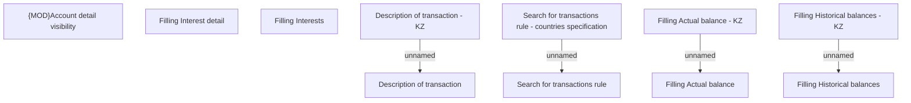

# Business rule

- **Diagram Type**: Custom
- **Package**: HomerSelect/BSL/Analysis Model/Account management/Account detail/Business rule
- **Diagram ID**: 126440
- **Elements**: 11
- **Connectors**: 4

