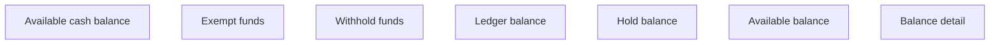

# Account balance detail panel

- **Diagram Type**: Custom
- **Package**: HomerSelect/BSL/Analysis Model/Account management/Account detail/User interface
- **Diagram ID**: 164345
- **Elements**: 7
- **Connectors**: 0

