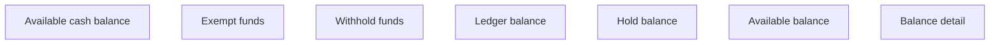

# Account balance detail panel

```mermaid
graph TD
    Available_cash_balance["Available cash balance"]
    Exempt_funds["Exempt funds"]
    Withhold_funds["Withhold funds"]
    Ledger_balance["Ledger balance"]
    Hold_balance["Hold balance"]
    Available_balance["Available balance"]
    Balance_detail["Balance detail"]
```
