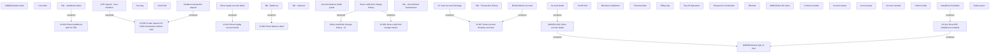

# Show account detail

```mermaid
graph TD
    ADD_Expiration_date["{ADD}Expiration date"]
    n_12_620_Show_installment_plan_for_REL["12.620 Show installment plan for REL"]
    Loan_offer["Loan offer"]
    LOP_request_User_Interface["LOP request - User Interface"]
    n_12_630_Create_request_for_CASH_transaction_without_card["12.630 Create request for CASH transaction without card"]
    Cardless_transaction_request["Cardless transaction request"]
    Due_day["Due day"]
    Cash_limit["Cash limit"]
    n_12_612_Show_loyalty_account_detail["12.612 Show loyalty account detail"]
    Show_loyalty_account_detail["Show loyalty account detail"]
    Tab_Installment_plans["Tab - Installment plans"]
    n_12_602_Show_balance_detail["12.602 Show balance detail"]
    Show_credit_limit_change_history_UI["Show credit limit change history - UI"]
    n_13_062_Show_credit_limit_change_history["13.062 Show credit limit change history"]
    Show_credit_limit_change_history["Show credit limit change history"]
    Tab_Interests["Tab - Interests"]
    Account_balance_detail_panel["Account balance detail panel"]
    UI_Card_account_blockage["UI: Card account blockage"]
    Tab_Unconfirmed_Transactions["Tab - Unconfirmed Transactions"]
    n_12_607_Show_account_blocking_overview["12.607 Show account blocking overview"]
    Block_Unblock_Account["Block/Unblock Account"]
    Tab_Transaction_History["Tab - Transaction History"]
    MOD_12_601_Show_account_detail["{MOD}12.601 Show account detail"]
    Tab_Balances["Tab - Balances"]
    MOD_Business_type_of_loan["{MOD}Business type of loan"]
    n_03_021_Show_REL_installment_schedule["03.021 Show REL installment schedule"]
    Installment_Schedule["Installment Schedule"]
    Credit_limit["Credit limit"]
    Minimum_installment["Minimum installment "]
    Financial_data["Financial data"]
    Billing_day["Billing day"]
    Pay_off_requested["Pay off requested"]
    Request_for_termination["Request for termination"]
    Blocked["Blocked"]
    MOD_Client_full_name["{MOD}Client full name"]
    Contract_number["Contract number"]
    Account_status["Account status"]
    Account_type["Account type"]
    Account_number["Account number"]
    Panel_of_tabs["Panel of tabs"]
    Account_detail["Account detail"]
    Button_panel["Button panel"]
    Account_detail["Account detail"]
    Installment_Schedule -->|unnamed| n_03_021_Show_REL_installment_schedule
    Account_detail -->|unnamed| MOD_12_601_Show_account_detail
    UI_Card_account_blockage -->|unnamed| n_12_607_Show_account_blocking_overview
    Block_Unblock_Account -->|unnamed| n_12_607_Show_account_blocking_overview
    Show_credit_limit_change_history -->|unnamed| n_13_062_Show_credit_limit_change_history
    Show_credit_limit_change_history -->|unnamed| Show_credit_limit_change_history_UI
    Tab_Balances -->|unnamed| n_12_602_Show_balance_detail
    Show_loyalty_account_detail -->|unnamed| n_12_612_Show_loyalty_account_detail
    LOP_request_User_Interface -->|unnamed| n_12_630_Create_request_for_CASH_transaction_without_card
    Cardless_transaction_request -->|unnamed| n_12_630_Create_request_for_CASH_transaction_without_card
    Tab_Installment_plans -->|unnamed| n_12_620_Show_installment_plan_for_REL
    MOD_12_601_Show_account_detail -->|unnamed| MOD_Business_type_of_loan
    n_03_021_Show_REL_installment_schedule -->|unnamed| MOD_Business_type_of_loan
```
