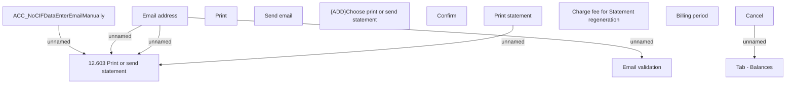

# Print Statement

```mermaid
graph TD
    Email_validation["Email validation"]
    ACC_NoCIFDataEnterEmailManually["ACC_NoCIFDataEnterEmailManually"]
    Email_address["Email address"]
    Email_address["Email address"]
    Print["Print"]
    Send_email["Send email"]
    ADD_Choose_print_or_send_statement["{ADD}Choose print or send statement"]
    Tab_Balances["Tab - Balances"]
    Confirm["Confirm"]
    Cancel["Cancel"]
    n_12_603_Print_or_send_statement["12.603 Print or send statement"]
    Charge_fee_for_Statement_regeneration["Charge fee for Statement regeneration"]
    Billing_period["Billing period"]
    Print_statement["Print statement"]
    ACC_NoCIFDataEnterEmailManually -->|unnamed| n_12_603_Print_or_send_statement
    Email_address -->|unnamed| n_12_603_Print_or_send_statement
    Email_address -->|unnamed| n_12_603_Print_or_send_statement
    Print_statement -->|unnamed| n_12_603_Print_or_send_statement
    Cancel -->|unnamed| Tab_Balances
    Email_address -->|unnamed| Email_validation
```
