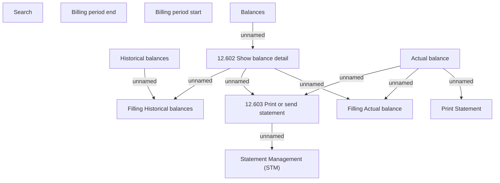

# Tab - Balances

- **Diagram Type**: Custom
- **Package**: HomerSelect/BSL/Analysis Model/Account management/Account detail/User interface/Tab - Balances
- **Diagram ID**: 133243
- **Elements**: 12
- **Connectors**: 9

