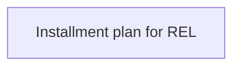

# Tab - Installment plans

- **Diagram Type**: Custom
- **Package**: HomerSelect/BSL/Analysis Model/Account management/Account detail/User interface/Tab - Installment plans
- **Diagram ID**: 127296
- **Elements**: 1
- **Connectors**: 0

