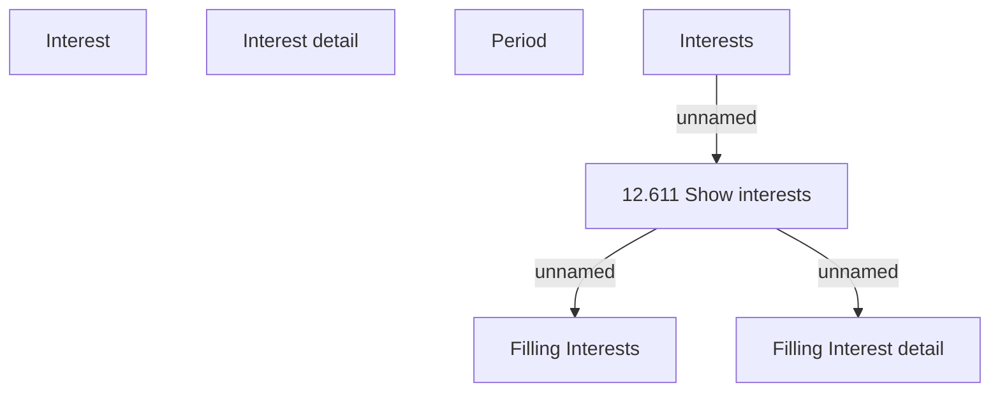

# Tab - Interests

- **Diagram Type**: Custom
- **Package**: HomerSelect/BSL/Analysis Model/Account management/Account detail/User interface/Tab - Interests
- **Diagram ID**: 63638
- **Elements**: 7
- **Connectors**: 3

