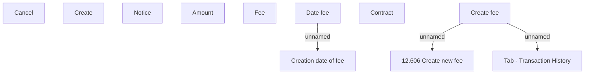

# Create fee

- **Diagram Type**: Custom
- **Package**: HomerSelect/BSL/Analysis Model/Account management/Account detail/User interface/Tab - Transaction History
- **Diagram ID**: 105059
- **Elements**: 11
- **Connectors**: 3

