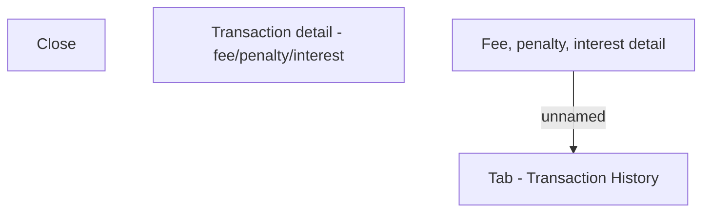

# Fee, Penalty, Interest detail 

- **Diagram Type**: Custom
- **Package**: HomerSelect/BSL/Analysis Model/Account management/Account detail/User interface/Tab - Transaction History
- **Diagram ID**: 105060
- **Elements**: 4
- **Connectors**: 1

