# Tab - Transaction History

- **Diagram Type**: Custom
- **Package**: HomerSelect/BSL/Analysis Model/Account management/Account detail/User interface/Tab - Transaction History
- **Diagram ID**: 105058
- **Elements**: 25
- **Connectors**: 10

```mermaid
graph TD
    Debit_Payment_detail["Debit/Payment detail"]
    RTL["RTL"]
    Billing_period["Billing period"]
    Including_recalculated_transactions["Including recalculated transactions"]
    Fee_Penalty_Interest_detail["Fee, Penalty, Interest detail "]
    Show_transactions["Show transactions"]
    Search_for_transactions_rule_countries_specification["Search for transactions rule - countries specification"]
    GORUA["GORUA"]
    Description_of_transaction["Description of transaction"]
    Search_for_transactions_rule["Search for transactions rule"]
    n_12_604_Show_transaction_history["12.604 Show transaction history"]
    n_12_605_Cancel_transaction["12.605 Cancel transaction"]
    n_12_606_Create_new_fee["12.606 Create new fee"]
    Search["Search"]
    Transaction_history["Transaction history"]
    Transaction_to["Transaction to"]
    Transaction_from["Transaction from "]
    Payments["Payments"]
    Penalties["Penalties"]
    Fees["Fees"]
    Interests["Interests"]
    Debits["Debits"]
    Filter["Filter"]
    Add_new_fee["Add new fee"]
    Transaction_history["Transaction history"]
    Add_new_fee -->|unnamed| n_12_606_Create_new_fee
    Transaction_history -->|unnamed| n_12_605_Cancel_transaction
    Transaction_history -->|unnamed| n_12_604_Show_transaction_history
    Transaction_history -->|unnamed| n_12_604_Show_transaction_history
    Billing_period -->|unnamed| Search_for_transactions_rule_countries_specification
    Transaction_history -->|unnamed| Fee_Penalty_Interest_detail
    Transaction_history -->|unnamed| Debit_Payment_detail
    Search_for_transactions_rule_countries_specification -->|unnamed| Search_for_transactions_rule
    n_12_604_Show_transaction_history -->|unnamed| Search_for_transactions_rule
    n_12_604_Show_transaction_history -->|unnamed| Description_of_transaction
```

