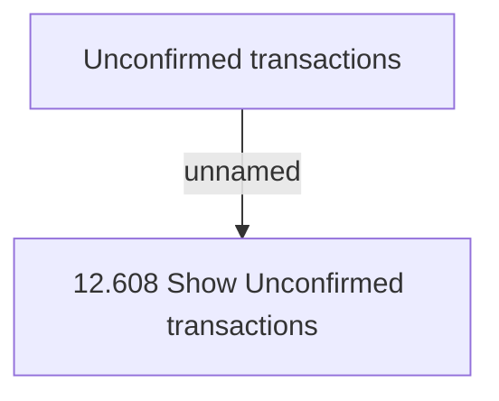

# Tab - Unconfirmed Transactions

- **Diagram Type**: Custom
- **Package**: HomerSelect/BSL/Analysis Model/Account management/Account detail/User interface/Tab - Unconfirmed Transactions
- **Diagram ID**: 65167
- **Elements**: 3
- **Connectors**: 1

