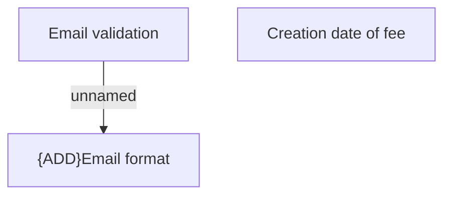

# Validation rule

- **Diagram Type**: Custom
- **Package**: HomerSelect/BSL/Analysis Model/Account management/Account detail/Validation rule
- **Diagram ID**: 105031
- **Elements**: 3
- **Connectors**: 1

