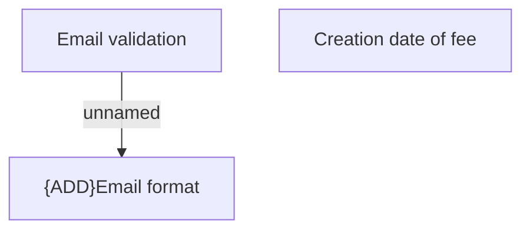

# Validation rule

```mermaid
graph TD
    ADD_Email_format["{ADD}Email format"]
    Email_validation["Email validation"]
    Creation_date_of_fee["Creation date of fee"]
    Email_validation -->|unnamed| ADD_Email_format
```
