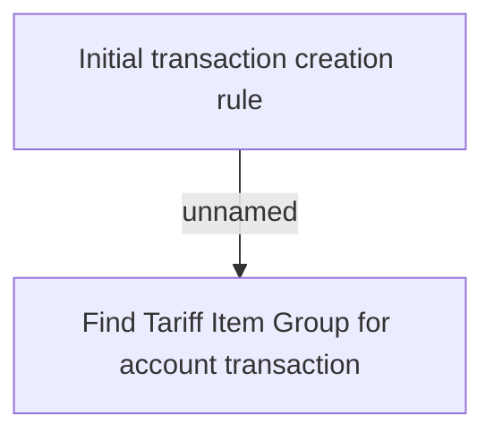

# Business rules

- **Diagram Type**: Custom
- **Package**: HomerSelect/BSL/Analysis Model/Account management/Account transaction/Business rules
- **Diagram ID**: 102676
- **Elements**: 2
- **Connectors**: 1

