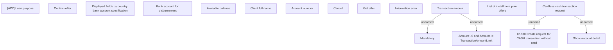

# Cardless cash transaction request - User Interface

```mermaid
graph TD
    ADD_Loan_purpose[" {ADD}Loan purpose"]
    Show_account_detail["Show account detail"]
    Confirm_offer["Confirm offer"]
    Displayed_fields_by_country_bank_account_specification["Displayed fields by country bank account specification"]
    Bank_account_for_disbursement["Bank account for disbursement"]
    n_12_630_Create_request_for_CASH_transaction_without_card["12.630 Create request for CASH transaction without card"]
    Amount_0_and_Amount_TransactionAmountLimit["Amount › 0 and Amount ‹= TransactionAmountLimit"]
    Mandatory["Mandatory"]
    Available_balance["Available balance"]
    Client_full_name["Client full name"]
    Account_number["Account number"]
    Cancel["Cancel"]
    Get_offer["Get offer"]
    Information_area["Information area"]
    Transaction_amount["Transaction amount"]
    List_of_installment_plan_offers["List of installment plan offers"]
    Cardless_cash_transaction_request["Cardless cash transaction request"]
    Transaction_amount -->|unnamed| Mandatory
    Transaction_amount -->|unnamed| Amount_0_and_Amount_TransactionAmountLimit
    Cardless_cash_transaction_request -->|unnamed| n_12_630_Create_request_for_CASH_transaction_without_card
    Cardless_cash_transaction_request -->|unnamed| Show_account_detail
```
