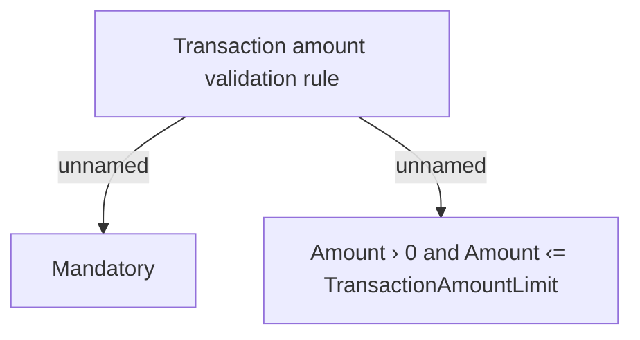

# LOP - Validation rules

```mermaid
graph TD
    Amount_0_and_Amount_TransactionAmountLimit["Amount › 0 and Amount ‹= TransactionAmountLimit"]
    Mandatory["Mandatory"]
    Transaction_amount_validation_rule["Transaction amount validation rule"]
    Transaction_amount_validation_rule -->|unnamed| Mandatory
    Transaction_amount_validation_rule -->|unnamed| Amount_0_and_Amount_TransactionAmountLimit
```
