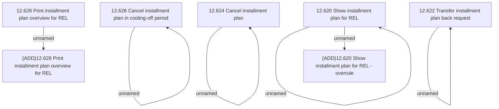

# Access Rights

- **Diagram Type**: Custom
- **Package**: HomerSelect/BSL/Analysis Model/Account management/Installment Plan for REL/Access Rights
- **Diagram ID**: 127297
- **Elements**: 11
- **Connectors**: 6

