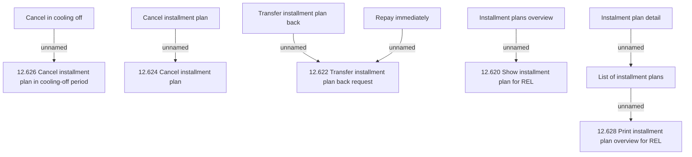

# Installment plan for REL

```mermaid
graph TD
    n_12_628_Print_installment_plan_overview_for_REL["12.628 Print installment plan overview for REL"]
    Transfer_installment_plan_back["Transfer installment plan back"]
    n_12_626_Cancel_installment_plan_in_cooling_off_period["12.626 Cancel installment plan in cooling-off period"]
    n_12_624_Cancel_installment_plan["12.624 Cancel installment plan"]
    n_12_622_Transfer_installment_plan_back_request["12.622 Transfer installment plan back request"]
    n_12_620_Show_installment_plan_for_REL["12.620 Show installment plan for REL"]
    Cancel_installment_plan["Cancel installment plan"]
    Cancel_in_cooling_off["Cancel in cooling off"]
    Repay_immediately["Repay immediately"]
    Instalment_plan_detail["Instalment plan detail"]
    List_of_installment_plans["List of installment plans"]
    Installment_plans_overview["Installment plans overview"]
    Instalment_plan_detail -->|unnamed| List_of_installment_plans
    Installment_plans_overview -->|unnamed| n_12_620_Show_installment_plan_for_REL
    Transfer_installment_plan_back -->|unnamed| n_12_622_Transfer_installment_plan_back_request
    Repay_immediately -->|unnamed| n_12_622_Transfer_installment_plan_back_request
    Cancel_installment_plan -->|unnamed| n_12_624_Cancel_installment_plan
    Cancel_in_cooling_off -->|unnamed| n_12_626_Cancel_installment_plan_in_cooling_off_period
    List_of_installment_plans -->|unnamed| n_12_628_Print_installment_plan_overview_for_REL
```
