# Transfer installment plan back

- **Diagram Type**: Custom
- **Package**: HomerSelect/BSL/Analysis Model/Account management/Installment Plan for REL/User Interface/Transfer installment plan back
- **Diagram ID**: 70572
- **Elements**: 13
- **Connectors**: 7

```mermaid
graph TD
    Selection_of_transfer_back_execution_date_rule["Selection of transfer back execution date rule"]
    Mandatory["Mandatory"]
    Validation_rules_for_Transfer_installment_plan_back["Validation rules for Transfer installment plan back"]
    n_12_622_Transfer_installment_plan_back_request["12.622 Transfer installment plan back request"]
    Confirm["Confirm"]
    Transfer_back_fee["Transfer back fee"]
    Amount_transferred_back["Amount transferred back"]
    Recalculate["Recalculate"]
    Cancel["Cancel"]
    Day_for_execution["Day for execution"]
    Execution_date["Execution date"]
    Transfer_back_reason["Transfer back reason"]
    Transfer_installment_plan_back["Transfer installment plan back"]
    Transfer_installment_plan_back -->|unnamed| n_12_622_Transfer_installment_plan_back_request
    Day_for_execution -->|unnamed| Mandatory
    Execution_date -->|unnamed| Mandatory
    Transfer_back_reason -->|unnamed| Mandatory
    Execution_date -->|unnamed| Selection_of_transfer_back_execution_date_rule
    Validation_rules_for_Transfer_installment_plan_back -->|unnamed| Selection_of_transfer_back_execution_date_rule
    Validation_rules_for_Transfer_installment_plan_back -->|unnamed| Mandatory
```

