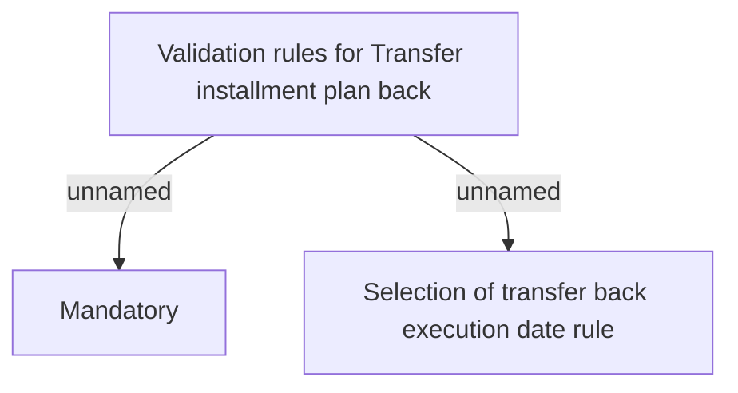

# Validation rules

- **Diagram Type**: Custom
- **Package**: HomerSelect/BSL/Analysis Model/Account management/Installment Plan for REL/Validation rules
- **Diagram ID**: 80265
- **Elements**: 3
- **Connectors**: 2

