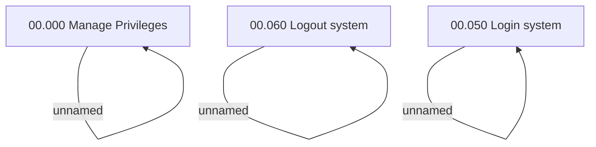

# Access Right

- **Diagram Type**: Custom
- **Package**: HomerSelect/BSL/Analysis Model/COMMON for BSL/Access control/Access Right
- **Diagram ID**: 102014
- **Elements**: 6
- **Connectors**: 3

```mermaid
graph TD
    n_00_000_Manage_Privileges["00.000 Manage Privileges"]
    n_00_000_Manage_Privileges["00.000 Manage Privileges"]
    n_00_060_Logout_system["00.060 Logout system"]
    n_00_050_Login_system["00.050 Login system"]
    n_00_060_Logout_system["00.060 Logout system"]
    n_00_050_Login_system["00.050 Login system"]
    n_00_060_Logout_system -->|unnamed| n_00_060_Logout_system
    n_00_000_Manage_Privileges -->|unnamed| n_00_000_Manage_Privileges
    n_00_050_Login_system -->|unnamed| n_00_050_Login_system
```
