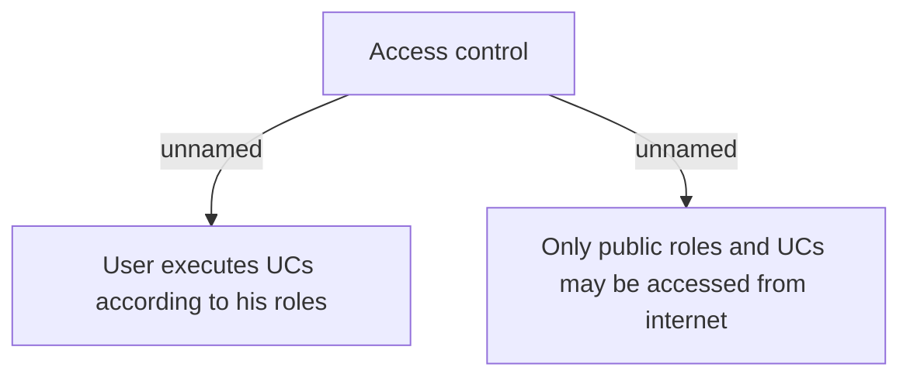

# Business rules

```mermaid
graph TD
    Access_control["Access control"]
    Only_public_roles_and_UCs_may_be_accessed_from_internet["Only public roles and UCs may be accessed from internet"]
    User_executes_UCs_according_to_his_roles["User executes UCs according to his roles"]
    Access_control -->|unnamed| User_executes_UCs_according_to_his_roles
    Access_control -->|unnamed| Only_public_roles_and_UCs_may_be_accessed_from_internet
```
