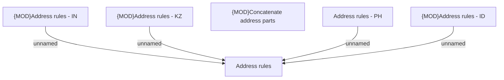

# Business Rules

```mermaid
graph TD
    Address_rules_PH["Address rules - PH"]
    MOD_Address_rules_KZ["{MOD}Address rules - KZ"]
    MOD_Concatenate_address_parts["{MOD}Concatenate address parts"]
    MOD_Address_rules_IN["{MOD}Address rules - IN"]
    MOD_Address_rules_ID["{MOD}Address rules - ID"]
    Address_rules["Address rules"]
    MOD_Address_rules_IN -->|unnamed| Address_rules
    MOD_Address_rules_KZ -->|unnamed| Address_rules
    Address_rules_PH -->|unnamed| Address_rules
    MOD_Address_rules_ID -->|unnamed| Address_rules
```
