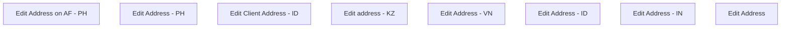

# Edit Address

- **Diagram Type**: Custom
- **Package**: HomerSelect/BSL/Analysis Model/COMMON for BSL/Address/User Interface
- **Diagram ID**: 134105
- **Elements**: 8
- **Connectors**: 0

```mermaid
graph TD
    Edit_Address_on_AF_PH["Edit Address on AF - PH"]
    Edit_Address_PH["Edit Address - PH"]
    Edit_Client_Address_ID["Edit Client Address - ID"]
    Edit_address_KZ["Edit address - KZ"]
    Edit_Address_VN["Edit Address - VN"]
    Edit_Address_ID["Edit Address - ID"]
    Edit_Address_IN["Edit Address - IN"]
    Edit_Address["Edit Address"]
```
