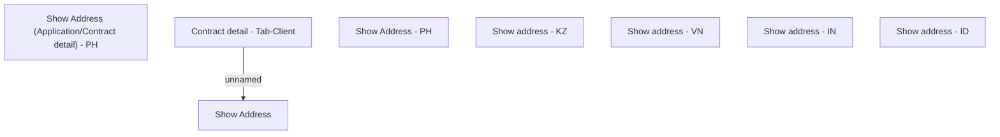

# Show address

- **Diagram Type**: Custom
- **Package**: HomerSelect/BSL/Analysis Model/COMMON for BSL/Address/User Interface
- **Diagram ID**: 134106
- **Elements**: 8
- **Connectors**: 1

```mermaid
graph TD
    Show_Address_Application_Contract_detail_PH["Show Address (Application/Contract detail) - PH"]
    Contract_detail_Tab_Client["Contract detail - Tab-Client"]
    Show_Address_PH["Show Address - PH"]
    Show_address_KZ["Show address - KZ"]
    Show_address_VN["Show address - VN"]
    Show_address_IN["Show address - IN"]
    Show_address_ID["Show address - ID"]
    Show_Address["Show Address"]
    Contract_detail_Tab_Client -->|unnamed| Show_Address
```
