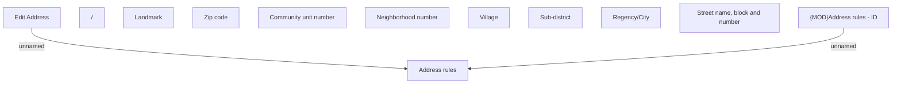

# Edit Client Address - ID

- **Diagram Type**: Custom
- **Package**: HomerSelect/BSL/Analysis Model/COMMON for BSL/Address/User Interface/ID
- **Diagram ID**: 134112
- **Elements**: 12
- **Connectors**: 2

