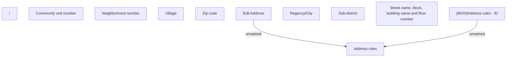

# Edit Employer Address - ID

```mermaid
graph TD
    n_["/"]
    Community_unit_number["Community unit number"]
    Neighborhood_number["Neighborhood number"]
    Village["Village"]
    Zip_code["Zip code"]
    MOD_Address_rules_ID["{MOD}Address rules - ID"]
    Address_rules["Address rules"]
    Regency_City["Regency/City"]
    Sub_district["Sub-district"]
    Street_name_block_building_name_and_floor_number["Street name, block, building name and floor number"]
    Edit_Address["Edit Address"]
    Edit_Address -->|unnamed| Address_rules
    MOD_Address_rules_ID -->|unnamed| Address_rules
```
