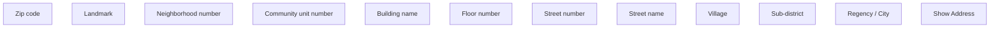

# Show address - ID

```mermaid
graph TD
    Zip_code["Zip code"]
    Landmark["Landmark"]
    Neighborhood_number["Neighborhood number"]
    Community_unit_number["Community unit number"]
    Building_name["Building name"]
    Floor_number["Floor number"]
    Street_number["Street number"]
    Street_name["Street name"]
    Village["Village"]
    Sub_district["Sub-district"]
    Regency_City["Regency / City"]
    Show_Address["Show Address"]
```
