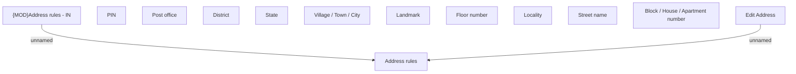

# Edit Address - IN

```mermaid
graph TD
    Address_rules["Address rules"]
    MOD_Address_rules_IN["{MOD}Address rules - IN"]
    PIN["PIN"]
    Post_office["Post office"]
    District["District"]
    State["State"]
    Village_Town_City["Village / Town / City"]
    Landmark["Landmark"]
    Floor_number["Floor number"]
    Locality["Locality"]
    Street_name["Street name"]
    Block_House_Apartment_number["Block / House / Apartment number"]
    Edit_Address["Edit Address"]
    MOD_Address_rules_IN -->|unnamed| Address_rules
    Edit_Address -->|unnamed| Address_rules
```
