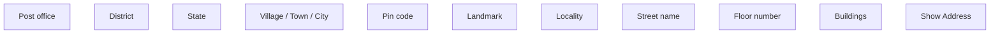

# Show address - IN

```mermaid
graph TD
    Post_office["Post office"]
    District["District"]
    State["State"]
    Village_Town_City["Village / Town / City"]
    Pin_code["Pin code"]
    Landmark["Landmark"]
    Locality["Locality"]
    Street_name["Street name"]
    Floor_number["Floor number"]
    Buildings["Buildings"]
    Show_Address["Show Address"]
```
