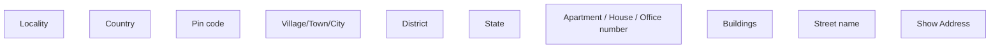

# Show address - KZ

```mermaid
graph TD
    Locality["Locality"]
    Country["Country"]
    Pin_code["Pin code"]
    Village_Town_City["Village/Town/City"]
    District["District"]
    State["State"]
    Apartment_House_Office_number["Apartment / House / Office number"]
    Buildings["Buildings"]
    Street_name["Street name"]
    Show_Address["Show Address"]
```
